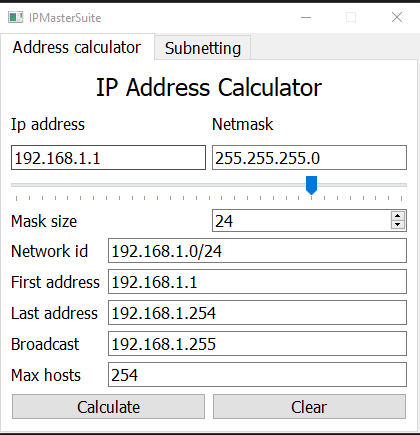
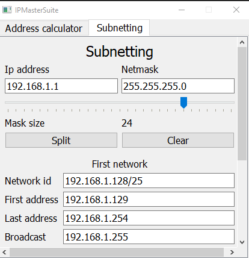

# IP Master Suite 🌐💻

IP Master Suite is a comprehensive Python GUI application designed to simplify and master IP address and subnet calculations. Whether you're a network administrator, a student learning about networking, or anyone else dealing with IP addresses, this tool will help you effortlessly perform essential calculations.




## Features

- Calculate network ID, first available address, last available address, and broadcast address for a given IP address and its subnet mask.
- Perform simple subnetting calculations, such as splitting a network.
- Intuitive and user-friendly graphical interface.
- Cross-platform compatibility: works on Windows and Linux.

## Installation

1. Clone this repository to your local machine:

   ```bash
   git clone https://github.com/your-username/IPMasterSuite.git


2. Navigate to the project directory:

   ```bash
   cd IPMasterSuite
   ```

3. Install dependencies:

   ```bash
   pip install -r requirements.txt
   ```

4. Run the application:

   ```bash
   python main.py
   ```

## Testing

Here's a screenshot of the application in action:


## FAQ

**Q: Can I use this tool for IPv6 addresses?**

A: Currently, IP Master Suite only supports IPv4 addresses and subnet calculations. However, future updates may include IPv6 support.

**Q: Is there a limit on the size of the subnet that can be split?**

A: The tool is designed to handle a wide range of subnet sizes. However, extremely large subnets may experience performance issues.

**Q: Can I contribute to this project?**

A: Absolutely! Contributions are welcome. Feel free to submit bug reports, feature requests, or even pull requests.

## Support

If you encounter any issues or have any questions, please [open an issue](https://github.com/your-username/ip-master-suite/issues) on GitHub. We'll do our best to assist you.

## License

This project is licensed under the MIT License - see the [MIT](LICENSE) file for details.
